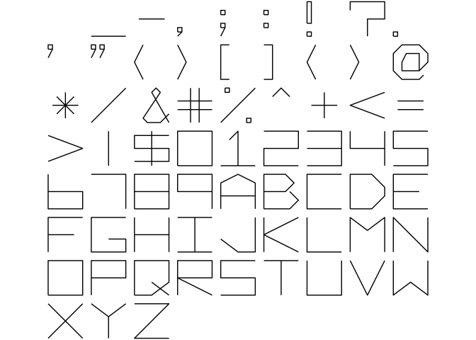
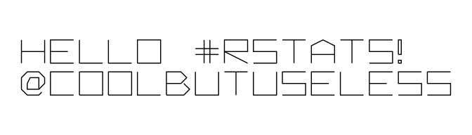
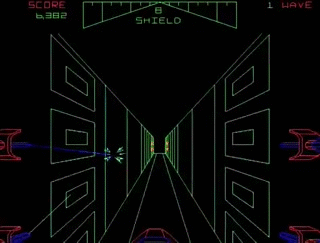
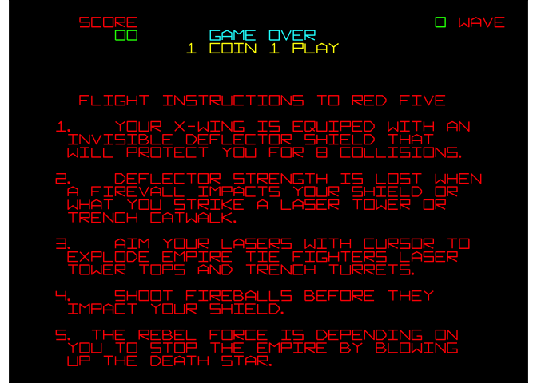

<!-- README.md is generated from README.Rmd. Please edit that file -->

# arcadefont

<!-- badges: start -->


<!-- badges: end -->

`arcadefont` provides raw vector data for an 80s arcade vector font -
similar to that seen in
[Battlezone](https://en.wikipedia.org/wiki/Battlezone_\(1980_video_game\))
or [Star
Wars](https://en.wikipedia.org/wiki/Star_Wars_\(1983_video_game\)). It
is a fixed-width, caps-only font.

This package was released on “May the 4th” 2020 - i.e. “Star Wars Day”.

This is similar to the [hershey vector font
package](https://github.com/coolbutuseless/hershey) in that it provides
point and stroke information, but how this is actually rendered is up to
you.

In the examples below `ggplot` is used to render the strokes for each
glyphs as `geom_path` objects.

## What’s in the box?

  - `arcade_df` - a data.frame of coordinates and stroke information for
    all the provided glyphs.
  - `create_text_df()` - a function to create stroke information for all
    the characters in a given string, and offset them appropriately
    (vertically and horizontally) so that they are ready to render.

## Installation

You can install from
[GitHub](https://github.com/coolbutuseless/arcadefont) with:

``` r
# install.packages("remotes")
remotes::install_github("coolbutuseless/arcadefont")
```

## Vector data source - `arcade_df`

The following output shows the data for the letter `A` contained in the
`arcade_df` data.frame.

  - letter - character represented in this data, in this case “A”
  - stroke - grouping variable for the points belonging to the same
    stroke. The letter ‘A’ is made of 2 strokes: 1. the frame of the A
    shape 2. the crossbar.
  - x,y - coordinates of points which make up a stroke. Coordinates are
    integer locations on a 9x9 grid.
  - idx - ordering index of points within each stroke

<!-- end list -->

``` r
arcadefont::arcade_df %>%
  filter(letter == 'A') %>%
  knitr::kable()
```

| letter | stroke | x | y | idx |
| :----- | :----- | -: | -: | --: |
| A      | 1      | 0 | 0 |   1 |
| A      | 1      | 0 | 6 |   2 |
| A      | 1      | 4 | 8 |   3 |
| A      | 1      | 8 | 6 |   4 |
| A      | 1      | 8 | 0 |   5 |
| A      | 2      | 0 | 3 |   1 |
| A      | 2      | 8 | 3 |   2 |

## Font Sample Sheet

A rendering of all the glyphs represented in `arcade_df`.

``` r
library(ggplot2)
library(arcadefont)

ggplot(arcadefont::arcade_df, aes(x, y)) + 
  geom_path(aes(group=stroke)) + 
  coord_fixed() + 
  theme_void() + 
  facet_wrap(~letter)  + 
  theme(
    strip.background = element_blank(),
    strip.text.x     = element_blank()
  )
```



## Create data for sequences of characters

A simple way to create all the strokes for lines of text is to use
`create_text_df()`.

This function will offset the characters along a row of text, and
arrange the characters over multiple lines.

``` r
text    <- "Hello #RStats!\n@coolbutuseless"
text_df <- arcadefont::create_text_df(text, dx = 2, dy = 3)

#~~~~~~~~~~~~~~~~~~~~~~~~~~~~~~~~~~~~~~~~~~~~~~~~~~~~~~~~~~~~~~~~~~~~~~~~~~~~~
# Plot it!
#~~~~~~~~~~~~~~~~~~~~~~~~~~~~~~~~~~~~~~~~~~~~~~~~~~~~~~~~~~~~~~~~~~~~~~~~~~~~~
ggplot(text_df, aes(x, y)) +
  geom_path(aes(group=interaction(char_idx, stroke))) +
  coord_fixed() +
  theme_void()
```



## Recreation of instructions screen for “Star Wars - The Arcade Game”

Star Wars is a 3D vector graphics arcade game released in 1983. See more
on
[wikipedia](https://en.wikipedia.org/wiki/Star_Wars_\(1983_video_game\))
and [playthrough video](https://www.youtube.com/watch?v=EA_kDTwZodQ).



When running in ‘attract mode’ the arcade machine displayed information
such as the high score table and instructions for playing.

Here I’ve recreated the instructions screen - colours too\!

``` r
library(dplyr)
library(ggplot2)
library(arcadefont)

#~~~~~~~~~~~~~~~~~~~~~~~~~~~~~~~~~~~~~~~~~~~~~~~~~~~~~~~~~~~~~~~~~~~~~~~~~~~~~
# Full text of the instructions screen
#~~~~~~~~~~~~~~~~~~~~~~~~~~~~~~~~~~~~~~~~~~~~~~~~~~~~~~~~~~~~~~~~~~~~~~~~~~~~~
text <- "
    score                         0 wave
       00      game over
             1 coin 1 play

    flight instructions to red five

  1.   your x-wing is equipped with an
   invisible deflector shield that
   will protect you for 8 collisions.

  2.   deflector strength is lost when
   a fireball impacts your shield or
   when you strike a laser tower or
   trench catwalk.

  3.   aim your lasers with cursor to
   explode empire tie fighters, laser
   tower tops and trench turrets.

  4.   shoot fireballs before they
   impact your shield.

  5. the rebel force is depending on
   you to stop the empire by blowing
   up the death star."


#~~~~~~~~~~~~~~~~~~~~~~~~~~~~~~~~~~~~~~~~~~~~~~~~~~~~~~~~~~~~~~~~~~~~~~~~~~~~~
# Create the text in the arcade font and set some colours
#~~~~~~~~~~~~~~~~~~~~~~~~~~~~~~~~~~~~~~~~~~~~~~~~~~~~~~~~~~~~~~~~~~~~~~~~~~~~~
text_df <- arcadefont::create_text_df(text, dx = 2, dy = 3)
text_df <- text_df %>% mutate(
  colour = case_when(
    line == 2 & letter == '0' ~ 'green',
    line == 2                 ~ 'red',
    line == 3 & letter == '0' ~ 'green',
    line == 3                 ~ 'cyan',
    line == 4                 ~ 'yellow',
    TRUE                      ~ 'red'
  )
)

#~~~~~~~~~~~~~~~~~~~~~~~~~~~~~~~~~~~~~~~~~~~~~~~~~~~~~~~~~~~~~~~~~~~~~~~~~~~~~
# Plot it!
#~~~~~~~~~~~~~~~~~~~~~~~~~~~~~~~~~~~~~~~~~~~~~~~~~~~~~~~~~~~~~~~~~~~~~~~~~~~~~
ggplot(text_df, aes(x, y)) +
  geom_path(aes(group=interaction(char_idx, stroke), colour = I(colour))) +
  coord_fixed() +
  theme_void() +
  theme(panel.background = element_rect(fill = 'black'))
```


